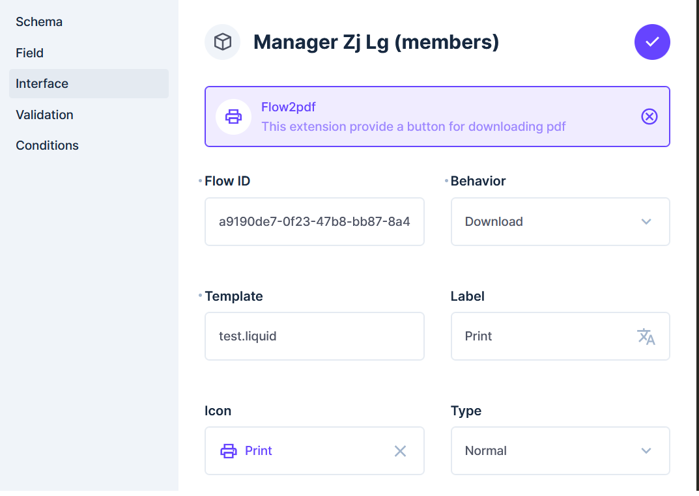

# Flow2Pdf

The `flow2pdf` extension is a bundle that allows directus to print data from flow results and liquid templates.

# Requirements

- Node.js 18 or higher
- `directus-extension-flow2pdf` installed on your Directus instance.

# Usage

The extension will add a new interface and endpoint to your directus instance.
All configurations are available in the pdf manager interface.

# Configuration

- Create a flow with `Webhook` trigger and set the method as `POST`, now copy the `id` of the flow.
- Create a `button Links` field in the desired collection and choose `Flow2PDF` as the interface.
- Add `extensions/template` directory and add your `.liquid` template.

- `Flow Id`: Id of the flow you will be collecting data from ( The last operation of your flow should return some json data ).
- `Behavior`: Accepts two values
  - `print`: To print the document from your printer
  - `download`: To download the pdf
- `Template`: the name of your liquid js template stored in `extensions/templates` directory. The data from your flow will be passed to the liquid fie.
- `label`: The label of the button
- `Icon`: The icon of the button
- `Type`: The type of the button. Same as directus button links types.
